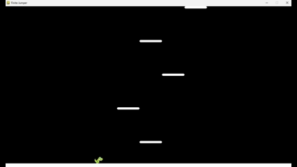

# Finite Jumper

Finite Jumper is a platformer built using Pygame. The objective is to ascend through a series of platforms, ultimately reaching the flag at the top to win.

## Gameplay & Features



- Jump from platform to platform as the screen scrolls upward
- Avoid falling off the bottom of the screen
- Reach the flag at the top to win
- Some platforms move horizontally with varying speeds; time your jumps carefully
- Soundtrack is synchronized with the game

## Controls

- **Left Arrow / A**: Move left
- **Right Arrow / D**: Move right
- Jumping is automatic

## Project Structure

- `assets/` - Images and sound files
- `main.py` - Entry point and main game loop
- `Game.py` - Game logic and state management
- `Jumper.py` - Player character logic
- `Tile.py` - Platform tiles
- `Ground.py` - Ground platform
- `Flag.py` - Victory flag
- `FallingSprite.py` - Falling sprites

## Requirements

- Python 3
- [Pygame](https://www.pygame.org/) (`pip install pygame`)

## Installation

### Non-developers

Check the [Releases](https://github.com/MJKagone/finite-jumper/releases) section for executable files.

### Developers

```
pip install pygame
git clone https://github.com/MJKagone/finite-jumper.git
cd finite-jumper
pip install -r requirements.txt
python main.py
```

## Credits

The project makes use of open source assets by the following artists:

- **Character sprites:** [pzUH](https://opengameart.org/content/free-dino-sprites)

- **Flag:** [hansolo](https://opengameart.org/content/banner-0)

- **Music:** [nene](https://opengameart.org/users/nene) & [celestialghost8](https://opengameart.org/users/celestialghost8)
